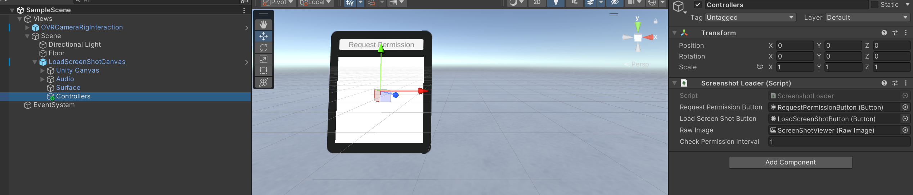

# Chef GPT
ChefGPT is a spatial AI-based chef that helps users create food based on available ingredients. It utilizes Meta SDKs, built on Quest 3, and OpenAI. It works by allowing the user to take an image of their fridge with the headset or voice out the ingredients at their disposal. From there, the AI generates three different recipes to pick from, then progresses through.

## Remaining Tasks
- [ ] Error handling around recipe generation (async task)
- [ ] 3D avatar animations + voice
- [x] Optimize performance for faster response times
- [ ] Image generator recipe + API usage
- [x] end-to-end testing
- [x] Port over to passthrough scene
- [x] Timer start/stop/alarm
- [x] Full recipe ui should be fully interactable
- [ ] Help menu UI
- [x] positioning of recipe prefab instantiation
- [ ] Sticky task progression menu
- [x] Increase size of all button colliders and grabbable panels
- [ ] watch stack
- [ ] manual invoke screenshot
- [ ] helper menu response window
- [ ] positioning of prefab windows
- [ ] sticky mode toggle palm menu
- [ ] 

## Environment
- Meta Quest Pro/3/2
- Unity Editor 2022.3.26f
## Dependencies
- [Meta Quest Screenshot Loader](https://github.com/t-34400/MetaQuestScreenshotLoader/)
- [OpenAI API](link-to-API)
- [Meta Voice SDK](link-to-SDK)
- [Meta Interaction SDK](link-to-SDK)
- [Meta Passthrough SDK](link-to-SDK)

<!-- ## Installation
1. Clone the project using the following command:
```bash
git clone --recurse-submodules https://github.com/t-34400/MetaQuestScreenShotLoaderSample.git
```
2. Select `Add` > `Add project from disk` from the `Projects` tab in Unity Hub, and open the cloned directory.
3. Click on the added project to launch the editor.
4. In the editor, open `Assets/Scenes/SampleScene` in the Project window.
5. Add the `ScreenShotLoader` component to the `Views/Scene/LoadScreenShotCanvas/Controllers` object in the scene and configure it as shown in the image below:

6. From the menu bar, select `File` > `Build Settings`, then choose Android in the  window and press the `Switch Platform` button.
7. From the menu bar, select `Edit` > `Project Settings`, then open `Meta XR` in the window and select the `Fix All` and `Apply All` buttons if available.
8. Build the project.
-->
